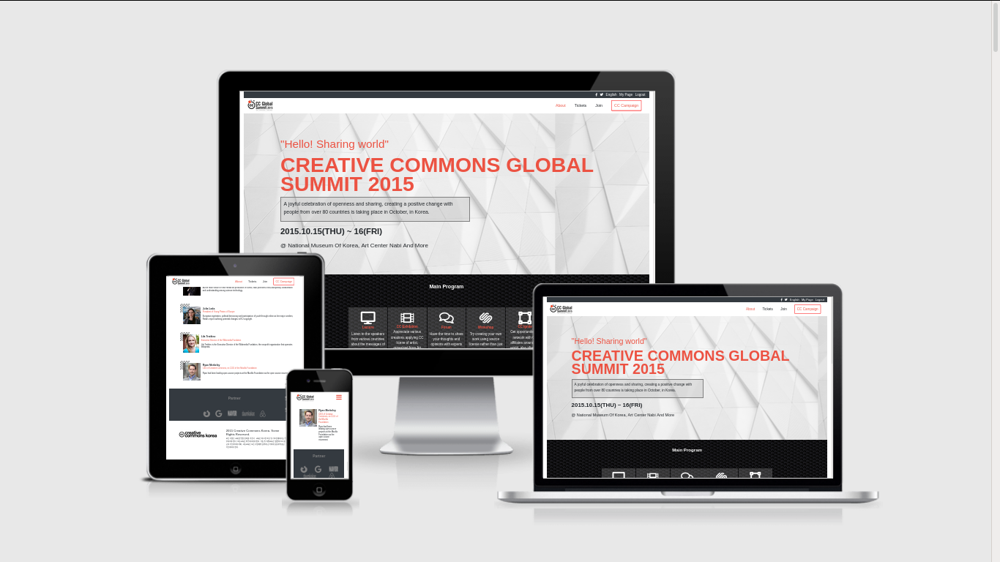

# Capstone-HTML

Building a page using HTML, CSS and Bootsrap that matches the appearance of this page [Behance.net](https://www.behance.net/gallery/29845175/CC-Global-Summit-2015)

  

# Built With

- [HTML](https://developer.mozilla.org/en-US/docs/Web/HTML)
- [CSS](https://www.w3schools.com/css/)
- [FontAwesome](https://fontawesome.com/)
- [Bootstrap](https://getbootstrap.com/)

# Live Demo

[Click here for Live Demo](https://jssarrazolaa.github.io/Capstone-HTML/)

# Authors

### Jhonatan Sarrazola

- Github: [@jssarrazolaa](https://github.com/jssarrazolaa)
- Twitter: [@StevenAlvarez_](https://twitter.com/StevenAlvarez_)
- Linkedin: [Jhonatan Sarrazola](https://www.linkedin.com/in/jhonatan-sarrazola-6a46a01a5/)

# Contributing

Contributions, issues and feature requests are welcome!
Feel free to check the [issues page](https://github.com/jssarrazolaa/Capstone-HTML/issues).

# Show your support

If you like our work, please give us a :+1:

# Acknowledgments

- Microverse
- W3schools
- Freecodecamp
- Developer.mozilla
- Learnshayhowe
- Odin project
- Bootstrap

# License

This project is [MIT](https://opensource.org/licenses/MIT) licensed.
